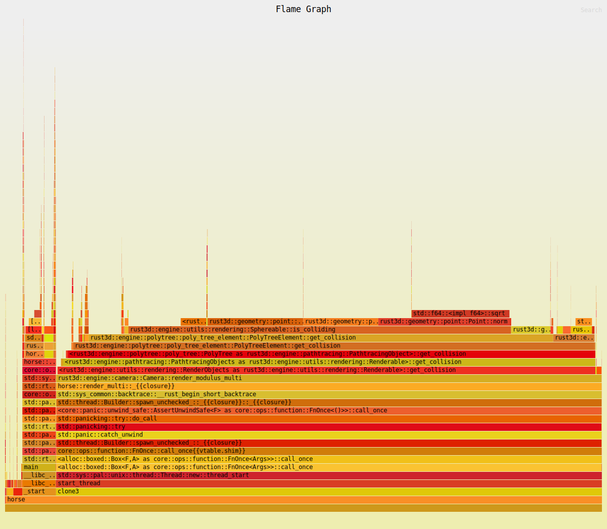

## Rust-Graphics
- This Engine is mainly used for experimenting with Computer Graphics
- With some exceptions, it is developed entirely from scratch
- Ray-Marching and Pathtracing Engine on the Cpu
- Using SDL2 for Media-Context
- Supports wavefront files (only triangles, one texture)
- For insights into the Internals so far, look at the flamegraph



- For Windows, SDL2 is bundled. For Linux / MacOS you need to install it yourself:
[SDL2](http://www.libsdl.org/)
- For Example: (Debian etc)
```shell
sudo apt install -y libsdl2-dev
```
- This Program is licensed under the GNU GPL-3.0 License: https://www.gnu.org/licenses/gpl-3.0.html
