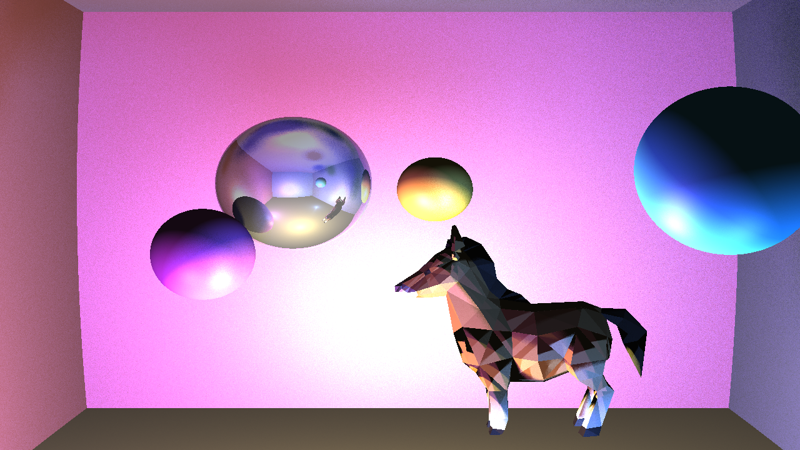
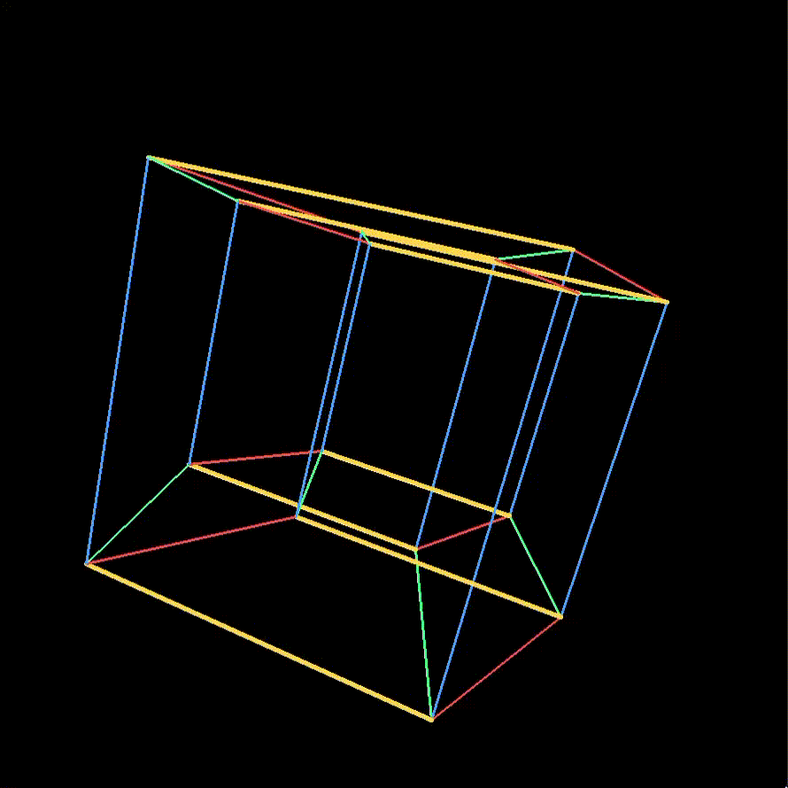
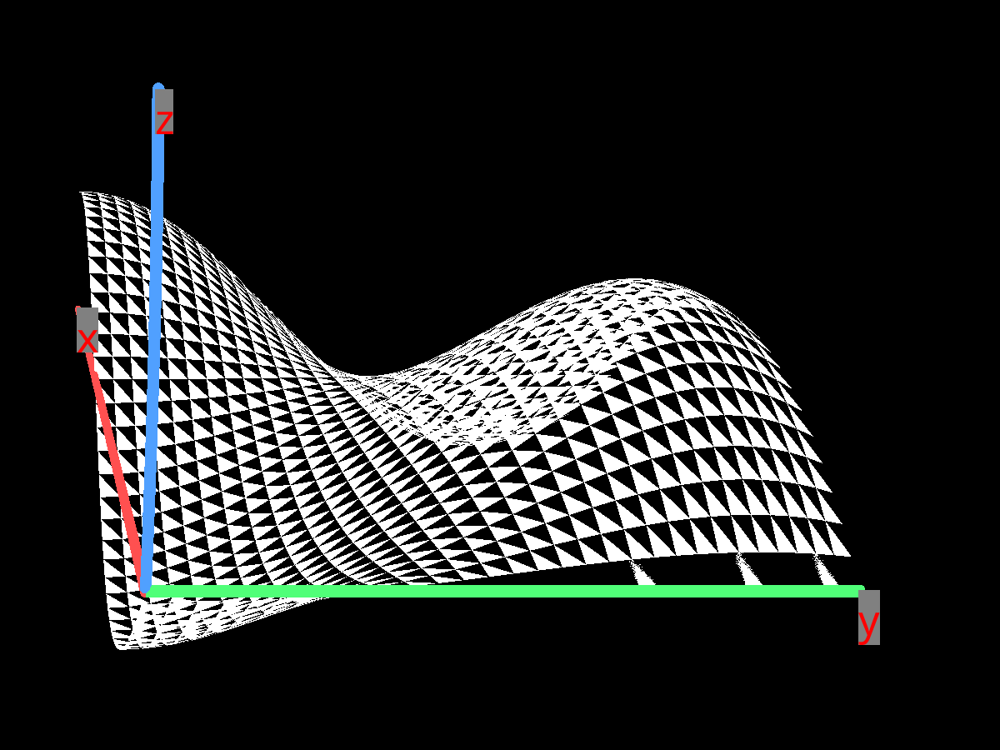
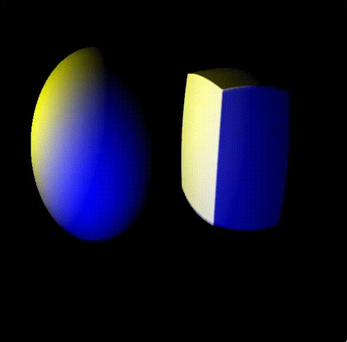
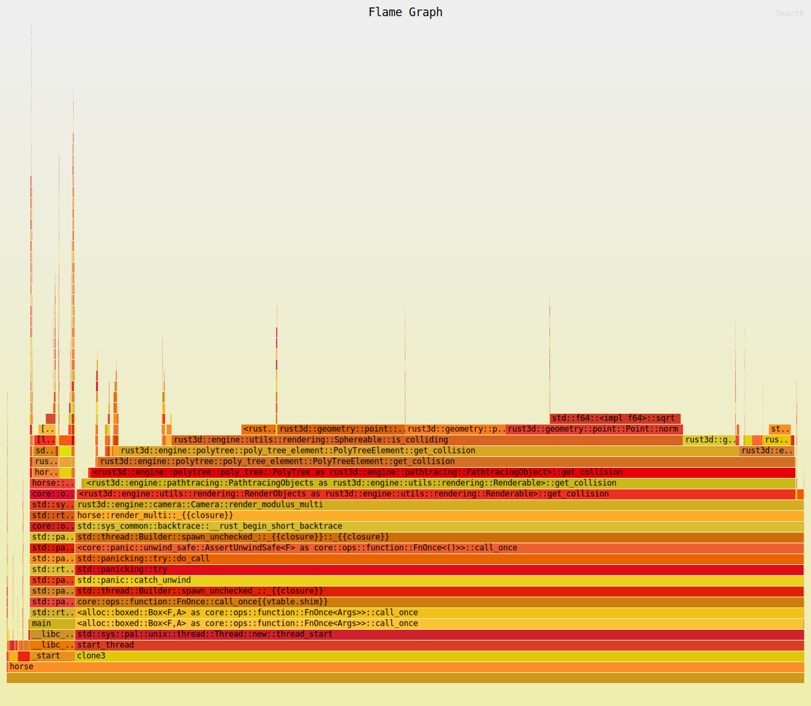

# Rust-Graphics
- This Engine is mainly used for experimenting with Computer Graphics
- written entirely from scratch (except for window-management and io via sdl2)
- Ray-Marching, Raytracing and Projection on the Cpu
- Supports wavefront files (only triangles, one texture)
- Some 2D Drawing Algorithms

- For Windows, SDL2 is bundled. For Linux / MacOS you need to install it yourself:
[SDL2](http://www.libsdl.org/)
  - For Example: (Debian etc)
  ```shell
  sudo apt install -y libsdl2-dev
  ```
  - on mac
  ```shell
  brew install sdl2
  ```
  and
  ```shell
  export HOMEBREW_PREFIX="$(brew --prefix)"
  export PKG_CONFIG_PATH="$HOMEBREW_PREFIX/opt/sdl2/lib/pkgconfig:$PKG_CONFIG_PATH"
  export LIBRARY_PATH="$HOMEBREW_PREFIX/opt/sdl2/lib:$LIBRARY_PATH"
  export CPATH="$HOMEBREW_PREFIX/opt/sdl2/include:$CPATH"
  ```
- This Program is licensed under the GNU GPL-3.0 License: https://www.gnu.org/licenses/gpl-3.0.html

## Showcase









## Flamegraph
- For insights into the Internals so far, look at the flamegraph

